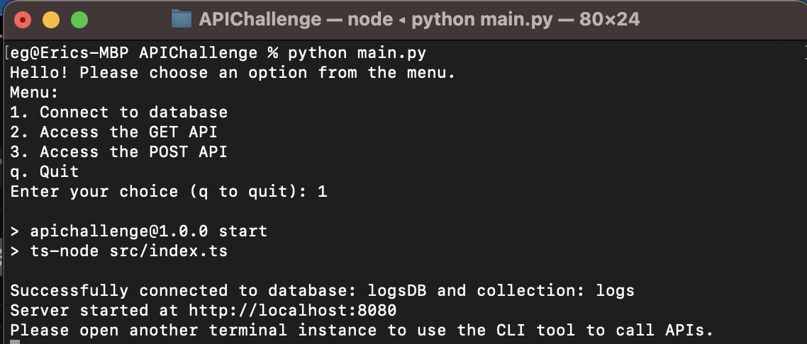

# Technical Challenge

Backend created with TypeScript, Express, and MongoDB. 

CLI Application created with Python standard library, Requests, and Click.

Pre-requisites: Need Python and Node/NPM installed.



## Installation and Usage

Clone the repo

```
git clone https://github.com/EricGip/APIChallenge.git
```

Cd into the root directory of the repo (where Package.json is located) and install dependencies:

```
npm install

pip install -U click requests
```

**IMPORTANT**  
Please fill in the fields inside `.env.example` with the credentials Paula has sent you.  
Rename `.env.example` to `.env`

In the same root directory, run the CLI application and start the connection to the database with (Option 1).  

```
python main.py 
```

Open another terminal instance in the same directory and run `python main.py` again to invoke the CALL / GET APIs through menu choices. 

Menu Choices:
   1. Connect to database  
   2. Access the GET API  
   3. Access the POST API  
   q. Quit  

#### Bugs: 
If you're using windows and you're getting an error of `FileNotFoundErorr: [WinError2]`, in the same root directory, please enter:

```
npm run start
```

then in another terminal instance, run `python main.py`, options 2 and 3 should function properly.

## Routes / Endpoints

## Access: 

Please use the CLI application to access the APIs, but here is how it works underneath the hood.

Base URL: localhost:8080/logs/ 

## GET

localhost:8080/logs/
   * returns all logs available/

localhost:8080/logs/:id
   * returns specific log with matching ID.

Parameters: 
id - _id field autogenerated by MongoDb.

### POST

localhost:8080/logs/  
   * post a single object / log into the database
Headers: Content-type: application-json.  
Expects single object/dictionary.

localhost:8080/logs/many
   * uploads an array of objects / logs into the database. 
Headers: Content-type: application-json.  
Expects array of objects/dictionaries.  

### Decisions

Since we are posting data, we need a persistent store and credentials for the database. I can think of doing this 5 ways. 

1. Sending db information in an email that's hopefully encrypted.  
   - I ended up using this because it's the most practical for our test app and done in the industry.
2. Hard coding credentials in .env and leaving it in repository. 
   - This is irresponsible to do while interviewing for a security role
3. Set up database with local MongoDb instance.
   - User may be need to download would require more overhead from the user.
4. Dockerize entire app, instantiate MongoDb within the container. 
   - User might need to have Docker Desktop installed (> 1gb) and may be on a slower / limited connection. Also, docker desktop takes a ton of RAM even just processing in the background.  
5. Dockerize app, host on serverless backend cloud app (AWS lambda or GCP cloud run should be enough), then call API with the CLI tool.
   - Requires more overhead than the project itself.


### Decompositioning / what my task is broken down: 

0. First thing we need is to connect to the database, have a script that does `npm run start` to initialize connection to server.
1. prompt user "what do you want to do?" get or post request
	1. if get, "sort objects descending by date and display results". Need way to present data nicer than just objects too.
		1. probably for loop, set into array / some kind of nicer text
	2. if post, should ask how many objects they want to enter   
		1. ~~if one, just prompt 3 questions of: name, type, description~~  
                     - Redundant, can just always ask if user wants to add more. 
		3. if multiple: just ask 4 questions: name, type, descrption, and add another? (Y/n)  
			1. if y, repeat questions, append object to array  
				1. need to make sure it appends with { } in front to tell db it's an object  
			2. if n, send post request with the array as the body.


### What I would add 
1. DELETE and PUT routes to edit and delete data.
2. Data validation
3. Api key
4. Docker so user doesn’t have to npm install and pip


Resources:

https://www.mongodb.com/compatibility/using-typescript-with-mongodb-tutorial  
https://click.palletsprojects.com/en/8.1.x/api/  
https://requests.readthedocs.io/en/latest/user/quickstart/  

https://docs.python.org/3/library/subprocess.html  
https://realpython.com/sort-python-dictionary/  
https://www.w3schools.com/python/ref_requests_post.asp  

https://stackoverflow.com/questions/55996487/attributeerror-function-object-has-no-attribute-name-when-using-click-to-cr
